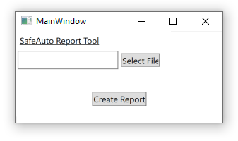

# SafeAutoCodeKata

This is a WPF project used to create a report from data contained in a text file (sample data shown below). Each line starts with word indicating the type of data contained in the line. The output report contains a list of the drivers sorted with their average speed and total distance. Ths list is sorted by total distance. 

## Sample Data
Driver John  
Trip John 7:30AM 12:00PM 30  
Trip Ryan 1:30PM 3:22PM 63  
Driver Josh  
Trip John 9:30AM 10:30AM 50  
Trip Josh 9:30PM 11:30PM 75  

## How to run application
The project can be compiled and run with Visual Studio

